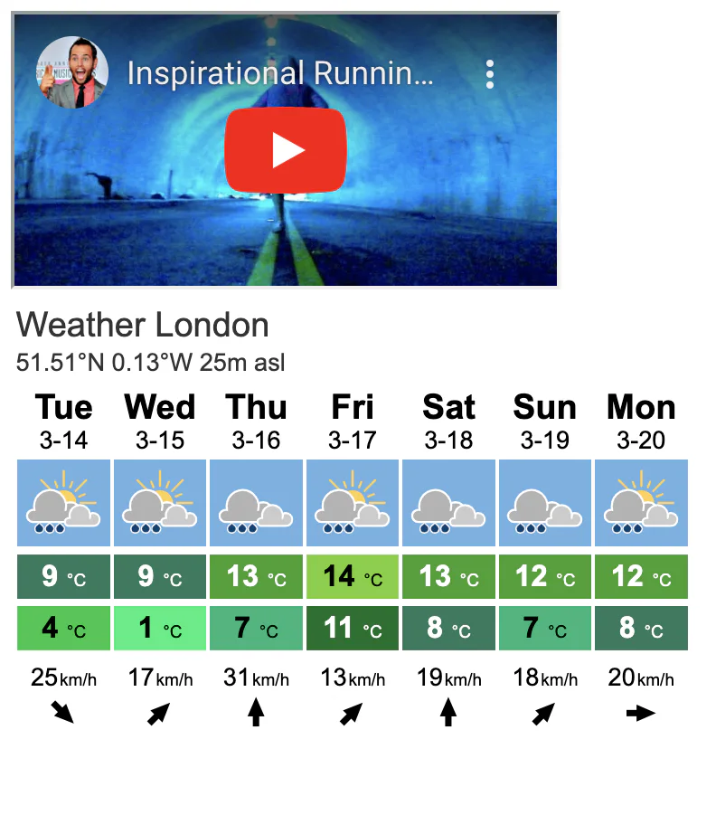
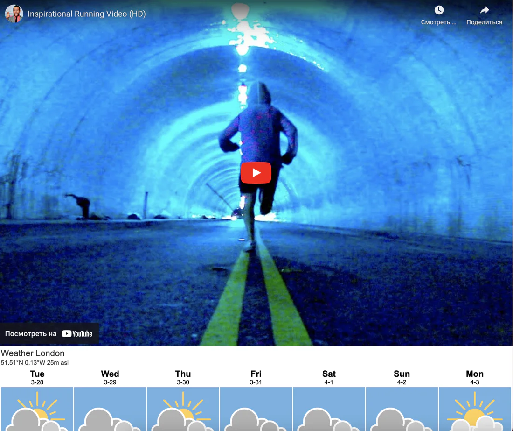

# site for marathon

- [site for marathon](#site-for-marathon)
  - [learning](#learning)
  - [about](#about)
  - [stages](#stages)
    - [1: embed iframes](#1-embed-iframes)
    - [2: style iframes with css](#2-style-iframes-with-css)

## learning
focus on htmls andc css: basic styles and positioning. use iframes to embed external content to your webpage. work with images and add animation.

## about
you were hired by an ngo to build a site for one of the marathons in london. there are certain requirements, the site must show distances, weather, and the map of the marathon. sound interesting? let's dive into it!

## stages
### 1: embed iframes
<details>
<summary>use iframes to add external content to a web page. start by adding a youtube video and a weather forcast to you page.</summary>

#### 1.1 description
let's start creating the landing page by adding two `iframes` to the page.

the first `iframe` should contain a motivational video for runners from youtube. you can choose any video that inspires and motivates runners to participate in the race.

the second `iframe` will display the london weather forecast. use the weather widget from [meteoblue](https://www.meteoblue.com/en/weather/widget/setupday). please configure the widget to display the weather of london for 7 days, including the icon, minimum and maximum temperature, wind speed and direction.

wrap each iframe in a block with an `iframe-container` class to further work with the styles.

#### 1.2 objectives
at the first stage, you should have:
- `iframe` with an embedded youtube video;
- `iframe` with a weather widget;
- each `iframe` must be wrapped in a block with a class `iframe-container`

#### 1.3 examples



</details>

### 2: style iframes with css
<details>
<summary>style the iframes in the previous stage with css, including positioning and sizing them to fit perfectly on your web page.</summary>

#### 2.1 description
in the previous stage, you added youtube and weather `iframes` to the landing page. now, change the style of these `iframes` using css so that they could fit the page perfectly.

position the `iframe-container` so that they follow each other and take up 100% of the screen width without `margins` or `padding`.

>at this stage, using relative units like `vw` for the `iframe-container` should help!

also, adjust the height of the youtube `iframe` and weather `iframe` to be 80% and 40% of the available screen height respectively while keeping the width of both frames. this will help users understand that our branding is not limited to just the video. you can use the `overflow` and `position` properties in your css code to position the elements.

finally, let's remove unnecessary controllers from the youtube `iframe`. `controls=0` will help you. 

#### 2.2 objectives
- set the width of both iframe-container to 100% of the screen width;
- set the height of the youtube `iframe` to 80% of the screen height and the height of the weather `iframe` to 40% of the screen height;
- remove any `margin` and `padding` from the `body` and `iframes`;
- hide the controls for youtube `iframe`.

>make sure to remove the already present inline css from the weather iframe.

#### 2.3 examples



</details>

[<<](https://github.com/eucarizan/front-end/blob/main/README.md)
<!--
:%s/\(Sample \(Input\|Output\) \d:\)\n\(.*\)/```\r\r**\1**\r```\3/gc

### 0: 
<details>
<summary></summary>

#### 0.1 description

#### 0.2 objectives

#### 0.3 examples

</details>
-->

