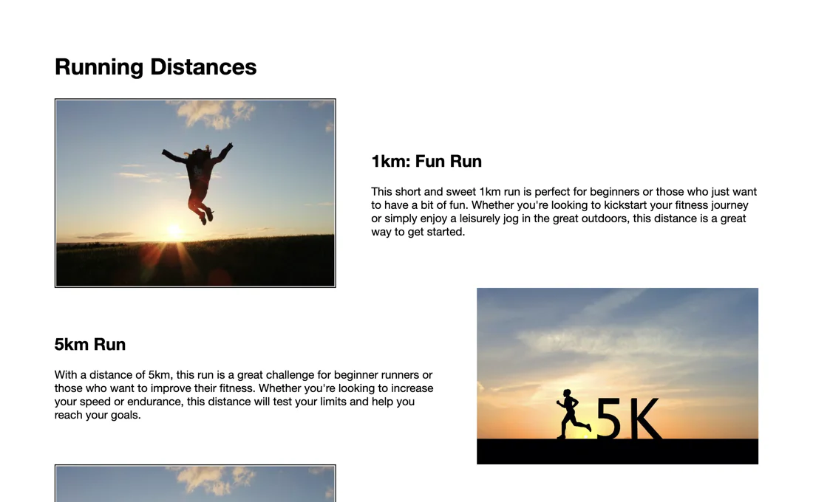

# site for marathon

- [site for marathon](#site-for-marathon)
  - [learning](#learning)
  - [about](#about)
  - [stages](#stages)
    - [1: embed iframes](#1-embed-iframes)
    - [2: style iframes with css](#2-style-iframes-with-css)
    - [3: add disances and descriptions](#3-add-distances-and-descriptions)
    - [4: content styling](#4-content-styling)
    - [5: add a map](#5-add-a-map)
    - [6: animate images](#6-animate-images)

## learning
focus on htmls andc css: basic styles and positioning. use iframes to embed external content to your webpage. work with images and add animation.

## about
you were hired by an ngo to build a site for one of the marathons in london. there are certain requirements, the site must show distances, weather, and the map of the marathon. sound interesting? let's dive into it!

## stages
### 1: embed iframes
<details>
<summary>use iframes to add external content to a web page. start by adding a youtube video and a weather forcast to you page.</summary>

#### 1.1 description
let's start creating the landing page by adding two `iframes` to the page.

the first `iframe` should contain a motivational video for runners from youtube. you can choose any video that inspires and motivates runners to participate in the race.

the second `iframe` will display the london weather forecast. use the weather widget from [meteoblue](https://www.meteoblue.com/en/weather/widget/setupday). please configure the widget to display the weather of london for 7 days, including the icon, minimum and maximum temperature, wind speed and direction.

wrap each iframe in a block with an `iframe-container` class to further work with the styles.

#### 1.2 objectives
at the first stage, you should have:
- `iframe` with an embedded youtube video;
- `iframe` with a weather widget;
- each `iframe` must be wrapped in a block with a class `iframe-container`

#### 1.3 examples


</details>

### 2: style iframes with css
<details>
<summary>style the iframes in the previous stage with css, including positioning and sizing them to fit perfectly on your web page.</summary>

#### 2.1 description
in the previous stage, you added youtube and weather `iframes` to the landing page. now, change the style of these `iframes` using css so that they could fit the page perfectly.

position the `iframe-container` so that they follow each other and take up 100% of the screen width without `margins` or `padding`.

>at this stage, using relative units like `vw` for the `iframe-container` should help!

also, adjust the height of the youtube `iframe` and weather `iframe` to be 80% and 40% of the available screen height respectively while keeping the width of both frames. this will help users understand that our branding is not limited to just the video. you can use the `overflow` and `position` properties in your css code to position the elements.

finally, let's remove unnecessary controllers from the youtube `iframe`. `controls=0` will help you. 

#### 2.2 objectives
- set the width of both iframe-container to 100% of the screen width;
- set the height of the youtube `iframe` to 80% of the screen height and the height of the weather `iframe` to 40% of the screen height;
- remove any `margin` and `padding` from the `body` and `iframes`;
- hide the controls for youtube `iframe`.

>make sure to remove the already present inline css from the weather iframe.

#### 2.3 examples


</details>

### 3: add distances and descriptions
<details>
<summary>add descriptions of distances and images to the project</summary>

#### 3.1 description
previously, you added youtube and weather `iframes` to the landing page and styled them using css. now it's time to add a list of distances along with their descriptions and images.

create a new block with the `distance-container` class below the iframes. inside this block, add a header (`h2`) with the text `running distances` and an unordered list (`ul`) with five list items (`li`) with the `distance` class. each list item should contain an image, a title, and a description of the distance.

>you can write content inside the lists section as per your choice. below given content is used in the example image.

here are the details for each distance:
- 1km, title `1km run`, the image is any fun running image, description: `this short and sweet 1km run is perfect for beginners or those who just want to have a bit of fun. whether you're looking to kickstart your fitness journey or simply enjoy a leisurely jog in the great outdoors, this distance is a great way to get started.`
- 5km, title `5km run`, the image is any image related to a 5 km race, description: `with a distance of 5km, this run is a great challenge for beginner runners or those who want to improve their fitness. whether you're looking to increase your speed or endurance, this distance will test your limits and help you reach your goals.`
- 10km, title `10km run`, the image is any image related to a 10 km race, description: `the 10km run is a great intermediate distance that offers a challenge to runners who have already tackled shorter races. with a mix of speed and endurance, this distance requires a bit more training and dedication, but the sense of accomplishment you'll feel at the finish line will be well worth it.`
- 21km, title `half marathon`, the image is any image related to a half marathon, description: `the half marathon is a major milestone for runners and requires dedicated training to complete. at a distance of 21km, this run will push you to your limits both physically and mentally, but the feeling of crossing the finish line is an experience like no other.`
- 42km, title `full marathon`, the image is any image related to a full marathon, description: `the full marathon is the ultimate challenge for runners and requires months of intense training to complete. with a distance of 42km, this run is not for the faint of heart, but for those who are willing to put in the time and effort, the feeling of crossing the finish line is a truly unforgettable experience.`

#### 3.2 objectives
1. create a block with class distance-container below iframes and add a h2 header with the text "running distances".
2. create an unordered list with five list items with the distance class inside the distance-container block.
3. put an image, title, and description for each distance.

#### 3.3 examples


</details>

### 4: content styling
<details>
<summary>add a button and the block title with a video to improve the style of the content you've added in the previous stage.</summary>

#### 4.1 description
in this stage, we will style the content added in the previous stage. we will adjust the fonts, align the text, and position the content to improve the overall visual appearance. we will also add a button and a title to the video block and style it. finally, we will adjust the layout of the running distances list by setting its maximum width and positioning it in the middle of the page from left to right. we will also adjust the position of the images in the list of items.

#### 4.2 objectives
- inside the block of youtube `iframe-container` class, place a block with the `video-overlay` class after the youtube `iframe`. this block should contain two tags: `h1` and `button`.
- add a title with short motivated content about running in the h1 tag inside the `video-overlay` class. set the distance from top 150px (using the top property) and center align the text. make the text color white with a font size of 73px.
- set width of `video-overlay` to 100vw and height equal to the height of `youtubeiframe`. you also have to center the container using flexbox and set the column direction to arrange the elements. the heading and button elements inside the `video-overlay` class must be evenly spaced with the button's text color as white.
- for more readability, place the `video-overlay` block under the `iframe-container` block with youtube iframe using `absolute` positioning and add a black background with 50% transparency.
- add a button to the video block with padding 5px 10px, a white border (4px) and white color, a transparent background, and text that says `join us!`. the font size is 24px.
- add the `roboto, helvetica neue, arial, sans-serif` fonts for the whole page.
- style the list with running distances (`distance-container`) by giving it a *maximum width of 1000px* and placing it in the middle of the page from left to right. let the font-size of the header of the list be 32px.
- alternate the image position on every list item so the image is on the left for even items and on the right for odd items. use the `float` property for this purpose. to prevent the list items from hovering over each other, apply the `clear` and `display`: table properties to each of them

#### 4.3 examples




</details>

### 5: add a map
<details>
<summary>let's add a google map with the starting point so that runners and spectators don't get lost.</summary>

#### 5.1 description
In this stage, we will enhance the web page by adding the Google map with a starting point. The map will provide participants and spectators with a visual representation of the race location, ensuring they can easily find their way to the starting point. You will generate an embedded map using Google Maps and add a title to the map to enhance its visibility.

#### 5.2 objectives
- generate an embedded google map with the starting point location by following these steps:
  1. go to [google maps](https://www.google.com/maps/).
  2. in the _search google maps_ text box, type in the address of the location you want to display on your web page. we will use big ben as a starting point.
  3. when the map appears, click on the *share* icon.
  4. select the _embed a map_ tab on the share window.
  5. click on the _copy html_ button to obtain the embedded map code.
- create a block with the class `map-container` and place the copied map `iframe` in it
- add a title (`h2`) to the map with the text `see you at big ben!` to indicate the event location.
- position the map and title in an appropriate layout on the web page.
- test the map functionality to verify that it displays the correct location and behaves as expected. please ensure that you are using the english language in your browser

#### 5.3 examples


</details>

### 6: animate images
<details>
<summary></summary>

#### 6.1 description
in the last stage, let's add animation effects to the images from stage 3 by adjusting their saturation. when the user hovers over an image, it will transition from its default state to full-color saturation. this will create a vibrant and dynamic effect.

#### 6.2 objectives
- add class `distance-image` for all images in the `distance` list.
- apply a saturation of 100% to the images by default.
- when the user hovers over an image, increase the saturation to 200%.
- ensure that the animation effect is consistent for all the images in the list.

#### 6.3 examples


</details>

[<<](https://github.com/eucarizan/front-end/blob/main/README.md)
<!--
:%s/\(Sample \(Input\|Output\) \d:\)\n\(.*\)/```\r\r**\1**\r```\3/gc
-->

